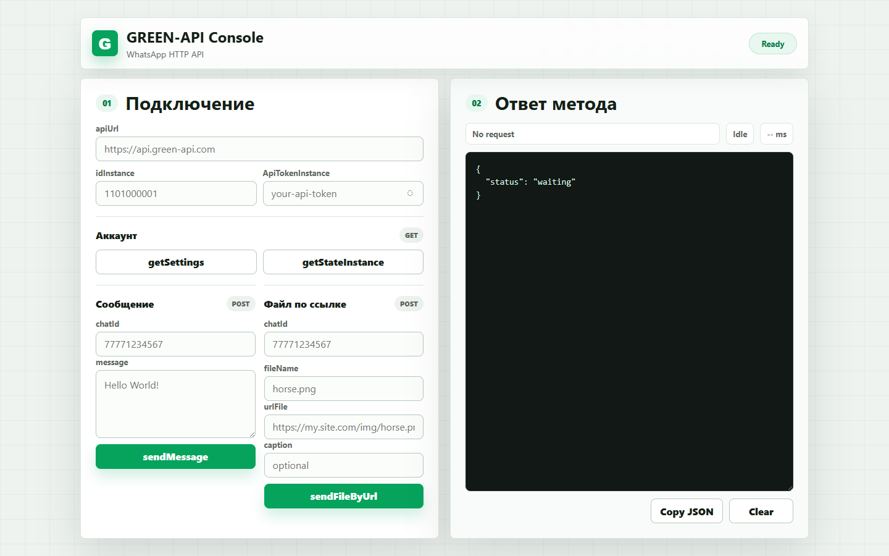
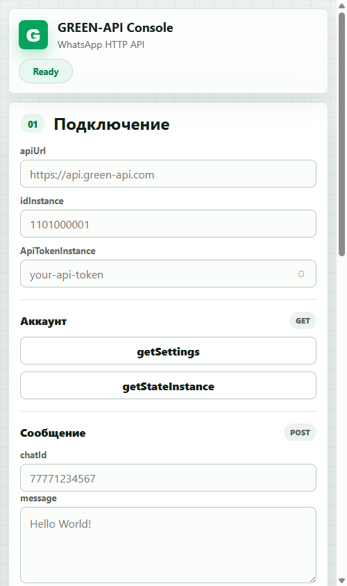

# GREEN-API Test Task

Статическая HTML-страница для тестового задания GREEN-API на должность DevOps-инженера.

Проект реализует форму для вызова методов GREEN-API прямо из браузера. Пользователь вводит параметры своего инстанса, запускает методы кнопками и видит JSON-ответ в отдельной read-only консоли.

## Скриншоты

| Desktop | Mobile |
| --- | --- |
|  |  |

## Реализованные методы

- `getSettings`
- `getStateInstance`
- `sendMessage`
- `sendFileByUrl`

## Возможности

- ввод `apiUrl`, `idInstance`, `ApiTokenInstance` через форму;
- вывод ответа методов в отдельное поле только для чтения;
- отправка текстового сообщения;
- отправка файла по публичной ссылке;
- автоматическое преобразование номера телефона в формат `chatId`, например `77000000000@c.us`;
- отображение HTTP-статуса, имени метода и времени выполнения запроса;
- копирование JSON-ответа;
- адаптивная верстка для desktop и mobile.

## Стек

- HTML5
- CSS3
- Vanilla JavaScript
- GREEN-API HTTP API

## Структура проекта

| Файл | За что отвечает |
| --- | --- |
| `index.html` | Разметка формы, кнопок методов и read-only консоли ответа |
| `styles.css` | Внешний вид, сетка, состояния кнопок и адаптив под мобильные экраны |
| `script.js` | Сборка запросов к GREEN-API, отправка методов и вывод JSON-ответа |
| `README.md` | Описание проекта, запуск, проверка и публикация |
| `.gitignore` | Исключает локальные PNG-файлы из публичного репозитория |

## Локальный запуск

Откройте файл `index.html` в браузере.

Дополнительная сборка или установка зависимостей не требуется.

## Как пользоваться

1. Создайте инстанс в личном кабинете GREEN-API.
2. Авторизуйте инстанс через QR-код.
3. Скопируйте параметры доступа:
   - `apiUrl`
   - `idInstance`
   - `ApiTokenInstance`
4. Вставьте параметры в форму на странице.
5. Нажмите `getStateInstance` и убедитесь, что инстанс авторизован.
6. Проверьте остальные методы.

Пример успешного ответа `getStateInstance`:

```json
{
  "stateInstance": "authorized"
}
```

## Проверка методов

### getSettings

Возвращает настройки инстанса.

### getStateInstance

Возвращает состояние инстанса. Для отправки сообщений ожидаемое состояние:

```json
{
  "stateInstance": "authorized"
}
```

### sendMessage

Поля:

- `chatId` - номер телефона получателя, например `77000000000`;
- `message` - текст сообщения.

Если ввести только номер, приложение автоматически добавит суффикс `@c.us`.

### sendFileByUrl

Поля:

- `chatId` - номер телефона получателя;
- `fileName` - имя файла;
- `urlFile` - публичная HTTPS-ссылка на файл;
- `caption` - необязательная подпись.

Ссылка в `urlFile` должна быть доступна извне без авторизации.

## Безопасность

`ApiTokenInstance` Не хранится в коде. Токен вводится вручную в браузере во время тестирования.

## Результат тестирования

Проект проверен на успешных ответах:

- `getSettings` - `200 OK`
- `getStateInstance` - `authorized`
- `sendMessage` - получен `idMessage`
- `sendFileByUrl` - получен `idMessage`
